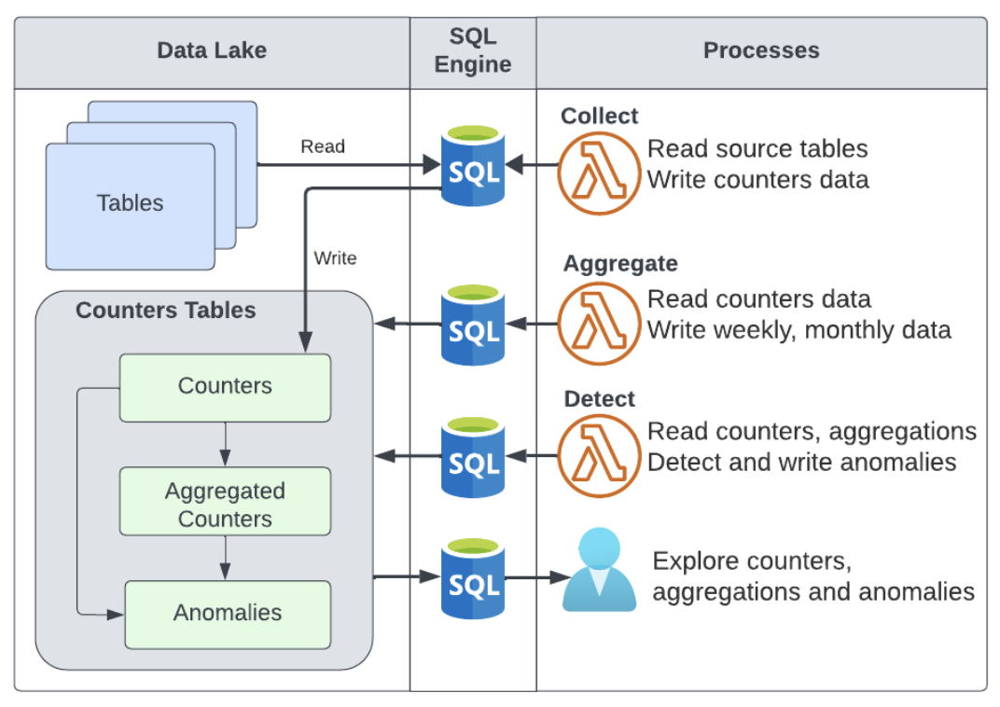

CountDB is a server-less counters collection, aggregation and anomaly detection engine powered by an SQL engine and cloud functions

CountDB has a streamlined counters process using configuration files and data containing many counters and valuable anomalies. The data is saved in dedicated data lake tables, which are accessed by the framework and can also be used in other use cases.

The data is collected from the source tables on a daily basis into the daily counters table. From there, the data gets to the aggregation and anomalies tables by different processes. All the data is accessible, as it is stored in data lake tables.



Blog post about CountDB concepts: https://www.imperva.com/blog/threat-hunting-through-anomaly-detection-on-your-data-lake/

## Getting started
To start using CountDB you have to deploy the CountDB lambda function to your AWS account, see the installation section below.
After you deploy CountDB you have to create a dataset file and use the CountDB CLI to upload it and update it. Once a dataset is added - data is collected, aggregated and anomalies are detected by CountDB. See more details in the Datasets anc CLI sections.

## Datasets

A dataset is a collection of counters stored in a JSON configuration file. Once dataset is uploaded its counters are collected, aggregated and anomalies are detect.

Dataset JSON structure:


| Property              | Description                                                                                                                                                                           | 
|-----------------------|---------------------------------------------------------------------------------------------------------------------------------------------------------------------------------------|
| dataset               | Dataset name                                                                                                                                                                          |
| prerequisites (array) | List of SQL commands which will run prior to counter collection if one or more will not return a value counter collection will not run. The {day} will be replaced with the input day |
| temp-tables           | Name to SQL. Used to reuse SQL and Data. Created before counter collection. To a temp table use their name with curly brackets. Example: {table_name}                                 |
| views                 | Name to SQL. Used to reuse SQL. Views are created once. To access a view use the the following name pattern: {dataset_name}_{view_name} under the countdb database                      |
| counters (array)      | List of counters to collect. For more details see the counters section below                                                                                                          |
Example JSON dataset:
```
{
 "dataset": "my_dataset",
 "prerequisites": ["SELECT 1 FROM my_table WHERE day = '{day}' LIMIT 1"],
 "counters": [{
     "id": 1,
     "name": "entity records",
     "sql": "
SELECT ARRAY[entity] AS int_key, ARRAY[] AS str_key, COUNT() AS value
FROM my_table
WHERE day = '{day}' GROUP BY entity"
   }
 ]
}
```
Counters information:

| Property   | Description                                                                                                                                                                                                                                                  |
|------------|--------------------------------------------------------------------------------------------------------------------------------------------------------------------------------------------------------------------------------------------------------------|
| id         | unique id inside of the dataset                                                                                                                                                                                                                              |
| name       | counter name                                                                                                                                                                                                                                                 |
| aggregate  | boolean indication whether this counter should be aggregate into weekly and monthly counters                                                                                                                                                                 |
| method     | aggregation method. Default is sum, can be changed to max                                                                                                                                                                                                    |
| max-record | boolean indication whether the max value for this counter should be tracked over time                                                                                                                                                                        |
| sql        | SQL statement for querying data. The query must return 3 columns: int_key, str_key and value. The keys columns are array, and they define the key, use the int and str columns according to the key type. The value is the numeric value for the counter key |
| value      | description for the collected value                                                                                                                                                                                                                          |


## countdb command line interface

CountDB cli is used to create and update datasets, and for maintenance operations like manual data collection and aggregation. Here are some useful commands:

CLI command and help:
```
countdb --help
```

Upload a dataset, dataset will be validated before upload. If there are JSON parse errors or SQL errors upload will fail:
```
countdb upload my-dataset.json
```

Collect a single day data for a dataset
```
countdb collect my-dataset --day=2024-06-01
```
Aggregate data for a days range
```
countdb collect my-dataset --from=2024-06-01 --to=2024-06-15
```
## Usage
Counters and anomalies data can be accessed using Athena. After you upload a dataset data will be collected, aggregated and anomalies will be detected. You can access the data from the following tables:

| Table                             | Description                                                    |
|-----------------------------------|----------------------------------------------------------------|
| daily_counters                    | Counters data, collected daily                                 |
| weekly_counters, monthly_counters | Data from the daily collected to the weekly and monthly tables |
| counters_metadata                 | Dataset and counters information                               |
| highlights                        | Detected anomalies                                             |
| max_counters                      | Daily, weekly and monthly max records                          |

## CountDB command line interface - First Use
To run the CLI you will need python, and boto3 AWS python API installed. You can install boto3 using the following command:

```pip install boto3```

The CLI is a single python application, that you can download from the repository and store locally. It is recommended to create an alias to the CLI. Here is an example command:

```alias countdb="python /your-location/countdb_cli.py"``` 

It is also recommended making the alias permanent. For example, the above command can be added to the ~/.bashrc file in multiple linux distributions, or ~/.zshrc in mac.

The CLI invokes the CountDB Lambda function. To use it you need AWS authentication with the relevant permissions. There are multiple options for authentication. You can run the CLI from an instance with a matching instance role, set environment variables, use a local file and more. You can find all the options under https://boto3.amazonaws.com/v1/documentation/api/latest/guide/credentials.html

## Installation
To install the project clone the repo and run the installation using CountDB CLI. Unlike most CLI operations, installation requires additional permissions, and not only Lambda invoke. Create and update lambda functions and Lambda triggers are needed, and should be done by a user with admin rights. 
You will also need to supply a role for the deployed lambda function, s3 bucket and an athena workgroup.

It is recommended to create a configuration file, which will be used by the CLI for installation and updates. The config file should be stored in the same location as the datasets files, under source control. Here is the required information inside the configuration file:

| Name        | Default Value | Description                                      |
|-------------|---------------|--------------------------------------------------|
| bucket      | countdb         | Bucket to hold CountDB information                 |
| workgroup   | countdb         | Athena workgroup to be used by CountDB             |
| athena-logs | countdb_temp    | Prefix under bucket used by Athena for temp data |
| region      | countdb_temp    | AWS region                                       |
| lambda-role | countdb_temp    | Role used by CountDB Lambda                        |

Here is a config file example:
```
{
  "bucket": "my-bucket",
  "workgroup": "countdb",
  "athena-logs": "temp/countdb/athena",
  "region": "us-east-1",
  "lambda-role": "arn:aws:iam::123456789:role/countdb-role"
}
```
Once a config file is created it is possible to install countdb using the CLI. Here is an [example](lambda-role-example-policy.json) for a Lambda role required permissions. To use the role template you will have to replace the account id, buckets, and database name with your own resource names. You can create a dedicated bucket, or use an existing one. Here are the permissions' description:

| Sid              | Description                                                                          |
|------------------|--------------------------------------------------------------------------------------|
| CountDBRead      | Allow CountDB read access to S3 data. Access will be done through Athena             |
| CountDBWrite     | Allow CountDB read and write permissions to its dedicated prefix, and to a temp dir  |
| CountDBBucket | Bucket level permissions for CountDB |
| CountDBAthena    | Allow CountDB to run Athena queries and use a specific workgroup                     |
| CountDBGlueRead  | Allow CountDB to use Glue catalog for read metadata operations                       |
| CountDBGlueWrite | Allow CountDB to use Glue catalog for write operations on the CountDB database       |
| CountDBLambda    | Allow CountDB to manage Lambda triggers, all resources will have an etl-infra prefix |
| CountDBLogs      | Allow CountDB Lambda to manage its logs under CloudWatch logs                        |

CountDB has additional configuration settings, allowing you to change the default values. Here are the configuration settings:

| Name               | Default Value | Description                                              |
|--------------------|---------------|----------------------------------------------------------|
| root-folder        | countdb         | Prefix to hold CountDB data and tables under               |
| database-name      | countdb         | Name of a database to create and hold CountDB tables under |
| temp-database-name | countdb_temp    | Database to create temporary tables used by CountDB        |

To install countdb go to the directory containing countdb config file and run the following command:

```countdb admin install```